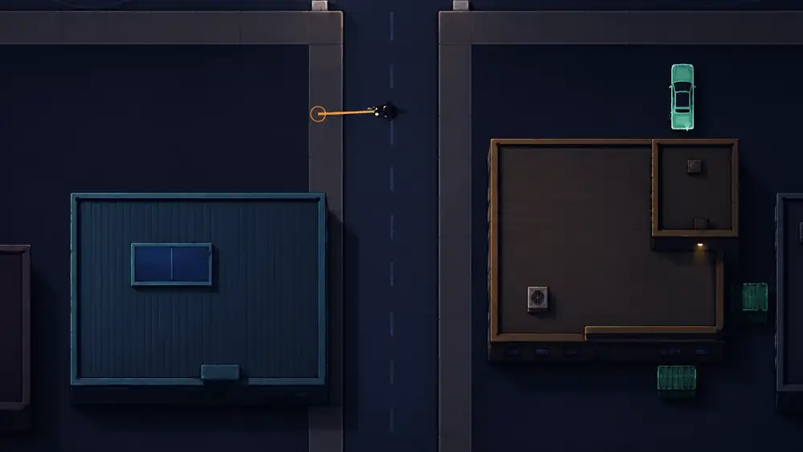

# Building visual polish initiative

> **Canonical visual direction for ViceBlood buildings**
>
> Status: **active**  
> Current milestone: **M1 — architectural parapets and shadow language**  
> Branch/PR: `agent/building-visual-poc` / PR #63  
> Last canonical audit: 2026-08-19

This document is the art-direction and acceptance authority for the building-polish initiative. The runtime architecture remains documented in [`BUILDING_PRESENTATION.md`](BUILDING_PRESENTATION.md). The operational agent contract is in [`agents/BUILDING_VISUAL_POLISH_AGENT.md`](agents/BUILDING_VISUAL_POLISH_AGENT.md), the milestone plan is in [`roadmaps/BUILDING_VISUAL_POLISH_ROADMAP.md`](roadmaps/BUILDING_VISUAL_POLISH_ROADMAP.md), and progress is recorded in [`progress/BUILDING_VISUAL_POLISH_PROGRESS.md`](progress/BUILDING_VISUAL_POLISH_PROGRESS.md).

## North star

The approved in-context overpaint is the primary visual target:

Supporting concept boards established the same constraints: pure overhead, chunky shared modules, restrained roof clutter and clear family identity. Their conclusions are incorporated below so an agent does not depend on chat attachments.

The target is not literal photorealism. It is a **game-ready, pure-overhead, dark urban illustration language** with enough material, depth and hierarchy to stop reading as procedural vector geometry.

## Product-level objective

Raise the existing modular building system from:

> coherent footprint + attractive outline + symbolic rooftop props

to:

> solid architectural mass + readable material + layered depth + physically integrated rooftop objects

without changing collision, navigation, city topology, streaming authority, missions, entrances, or rooftop traversal.

## Mandatory reading order

An agent working on this initiative must read, in order:

1. [`AGENT_DEVELOPMENT.md`](AGENT_DEVELOPMENT.md)
2. [`BUILDING_PRESENTATION.md`](BUILDING_PRESENTATION.md)
3. this document
4. [`agents/BUILDING_VISUAL_POLISH_AGENT.md`](agents/BUILDING_VISUAL_POLISH_AGENT.md)
5. [`roadmaps/BUILDING_VISUAL_POLISH_ROADMAP.md`](roadmaps/BUILDING_VISUAL_POLISH_ROADMAP.md)
6. [`progress/BUILDING_VISUAL_POLISH_PROGRESS.md`](progress/BUILDING_VISUAL_POLISH_PROGRESS.md)
7. [`progress/building-visual-polish-status.json`](progress/building-visual-polish-status.json)

The status JSON is the compact machine-readable pointer. The roadmap is the planning authority. The progress log is append-only evidence.

## Visual reading order

Every building must read in this order at normal gameplay zoom:

1. **silhouette**
2. **architectural depth**
3. **building-family identity**
4. **one hero rooftop element**
5. **at most one supporting element**

A player must never read the internal modular grid before the building itself.

## Core visual principles

### Modular inside, unified outside

Logical cells, masks and shared modules are implementation details. Adjacent modules must fuse into a coherent roof mass. Internal seams may exist only when they represent intentional roof material or structural joints, never because the planner used a grid.

### Architectural parapets, not interface borders

A parapet must communicate construction through:

- a muted top cap;
- a narrow inner occlusion;
- a darker south/east wall face;
- a restrained north/west highlight;
- a small contact shadow;
- consistent corner treatment.

It must not resemble a glowing HUD frame, double-outline, selection box, or neon stroke unless the building is explicitly a nightlife landmark and the neon is a separate identity accent.

### Layered shadows

The renderer must distinguish:

- **world cast shadow** — the building shadow on the surrounding ground;
- **wall depth** — the south/east face of the roof mass;
- **roof contact shadow** — the raised mass above the low service roof;
- **prop contact shadow** — local occlusion beneath HVAC, skylights, annexes and hatches.

One opaque black rectangle is not an acceptable substitute for these layers.

### Material before noise

Surfaces need subtle material cues, not texture noise:

- broad tonal modulation;
- restrained seams;
- integrated corrugation;
- directional highlights;
- occasional service wear;
- no high-frequency speckle field;
- no repeated decorative slots that read as a UI pattern.

### Props are objects, not symbols

A rooftop prop should have:

- a frame or casing;
- a top surface;
- at least one darker side or contact shadow;
- a clear orientation;
- scale appropriate to gameplay zoom;
- integration with the roof composition.

Crosses, medical symbols and civic marks may identify a building, but they cannot be the only reason it reads as that building type.

## Baseline screenshot audit

These captures are the baseline from which M1–M5 are measured. They are evidence, not targets.

### Warehouse and industrial

Findings:

- silhouettes and profile colours are correct;
- parapets are too bright and double-lined;
- roof shadows are hard rectangular blocks;
- corrugation is too uniform;
- skylight and HVAC still read as placed icons;
- industrial annex needs stronger raised-volume language.

### Hospital area

Findings:

- medical colour coding exists but no dedicated hospital grammar exists yet;
- large roof is too empty and generic;
- medical markers are symbolic rather than architectural;
- the small red/pink block is ambiguous;
- the family needs clean mechanical plant, grouped service zones and a controlled institutional hierarchy.

### Police station

Findings:

- civic symmetry and blue language are readable;
- facade/service slots are too repetitive;
- the parapet still reads as a bright frame;
- the entrance and equipment composition need more authority and depth.

### Untagged generic block

Findings:

- clean neutral mass but no intentional identity;
- overly empty roof;
- isolated hatch/vent symbols do not create composition;
- this must become either deliberately generic or explicitly profiled.

### Church

Findings:

- cross silhouette and religious semantics are clear;
- ridges read as diagram lines rather than pitched structure;
- monumentality is weak;
- parapet and wall treatment need more weight;
- the lower rectangular chapel-like block needs a clearer relation to the main church grammar.

### Nightlife / club blocks

Findings:

- magenta colour strongly suggests nightlife;
- some buildings are only “purple rectangles”;
- neon is too close to a UI outline;
- roofs need one strong nightlife feature and more intentional service composition.

### Mixed city context

Findings:

- the modular system already creates useful variety;
- visual quality is inconsistent between profiles;
- the best warehouse treatment exposes how flat generic and commercial roofs still feel;
- all profiles need one shared architectural depth language before profile-specific polish.

## Building-family grammar

### Warehouse

Required cues:

- one unified industrial mass;
- integrated corrugated roof;
- long skylight or roof monitor;
- restrained service strip;
- cool steel/blue-grey material;
- sturdy, non-luminous parapet.

Avoid:

- identical high-contrast ribs;
- centered “icon” skylight without contact;
- decorative repeated windows with no service logic.

### Industrial / works

Required cues:

- warm or dirty neutral membrane roof;
- one large mechanical unit;
- raised service annex or loading volume;
- limited warm service light;
- broad seams, not room outlines.

Avoid:

- annex drawn as an interior rectangle;
- scattered tiny vents;
- large empty roof with one token symbol.

### Police

Required cues:

- ordered civic massing;
- readable entrance/canopy;
- restrained blue civic accents;
- antenna/communications composition;
- clean service rhythm with controlled variation.

Avoid:

- dependence on a `POLICE` label;
- repeated identical slots;
- bright frame around the whole roof.

### Hospital / medical

Required cues:

- cool institutional palette;
- grouped clean HVAC/plant area;
- one or more controlled skylights;
- medical identity integrated into canopy, helipad-like service geometry or roof organisation;
- clear main block versus clinical annex hierarchy.

Avoid:

- one floating medical icon on an otherwise generic roof;
- nightclub-like red/magenta outline;
- random mechanical clutter.

### Church

Required cues:

- axial massing;
- pitched-roof or nave reading;
- ridges with shadow and volume;
- small warm religious marker;
- stronger monumental hierarchy than ordinary blocks.

Avoid:

- floorplan-line reading;
- oversized symbolic cross doing all semantic work;
- bright outline around every edge.

### Club / nightlife

Required cues:

- dark compact or irregular mass;
- one integrated neon accent, not a full selection outline;
- dominant skylight/rooflight or nightlife feature;
- service access or equipment placed asymmetrically but intentionally;
- decadent magenta/purple accents on a mostly dark roof.

Avoid:

- plain purple rectangles;
- neon tracing every edge equally;
- empty roof plus one token vent.

### Generic / residential / commercial

Required cues:

- intentional neutrality;
- one clear roof composition;
- subtle family-specific material;
- enough variation to avoid placeholder reading.

Avoid:

- ambiguity caused by missing authorship;
- two isolated symbols on a blank rectangle;
- accidental landmark colours.

## Non-negotiable technical boundaries

- Authored `x`, `y`, `w`, `h` remain the sole collision and navigation truth.
- No building-polish task may hand-edit generated city topology.
- No renderer change may mutate gameplay state.
- No new profile may become a second semantic or mission authority.
- Visual shadows may extend outside the footprint; planned modules may not.
- No hardcoded per-building render branch unless an explicit authored override is documented and tested.
- Normal gameplay labels remain opt-in.
- The system must stay deterministic for the same authored building and seed.
- The `standard` detail level remains sparse at normal gameplay zoom.
- Unknown future modules must fail soft rather than crash rendering.

## Acceptance rubric

Score each reviewed building from 0 to 2 in every category:

| Category | 0 | 1 | 2 |
|---|---|---|---|
| Silhouette | placeholder/ambiguous | readable but generic | strong and intentional |
| Parapet | UI outline | partially architectural | clear cap, wall and occlusion |
| Shadow | hard block/no depth | some layering | cast, wall and contact layers |
| Material | flat fill | basic seams | integrated readable material |
| Props | icons | partly volumetric | physical and compositionally integrated |
| Family identity | colour/tag only | partially readable | readable without label |
| Gameplay clarity | noisy/unclear | acceptable | clean at normal zoom |

A profile is visually approved only when representative captures average **at least 1.6**, with no zero in gameplay clarity, silhouette, parapet or shadow.

## Definition of done

The initiative is complete when:

- M0–M6 are marked complete in the roadmap and status JSON;
- representative screenshots exist for warehouse, industrial, police, hospital, church, club and generic buildings;
- those captures meet the acceptance rubric;
- focused tests pass;
- no new failures are introduced outside the known pre-existing suite failures;
- the PR is no longer draft;
- the progress log contains a final validation and merge-readiness entry.
