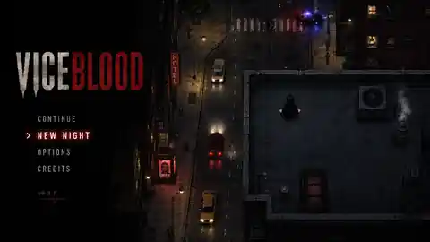
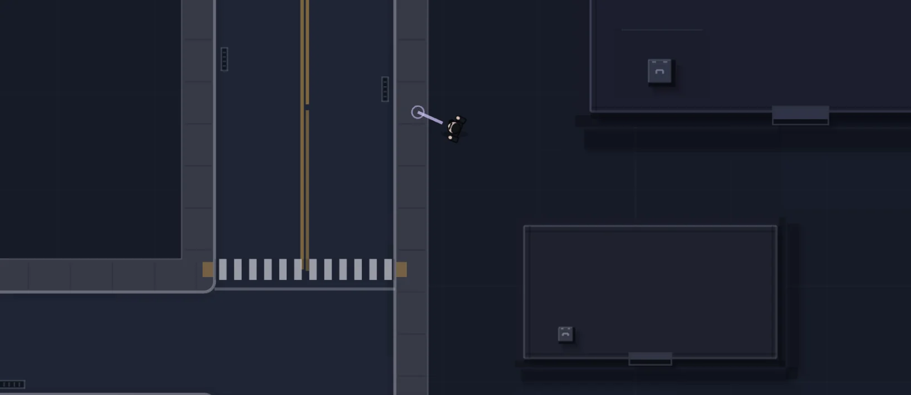

# ViceBlood city noir atmosphere initiative

> **Canonical art-direction and acceptance authority for the city-atmosphere pass**
>
> Status: **planned / bootstrap complete**  
> Branch/PR: `agent/city-noir-atmosphere` / draft PR  
> Created: 2026-08-21

This initiative exists to close the gap between the current readable procedural city and the approved ViceBlood mood target **without rebuilding the city, replacing its topology, or chasing photorealistic asset production**.

The intended outcome is a city that still uses the current scalable top-down language, but reads as **wet, decaying, nocturnal, dangerous and inhabited**: deep darkness, small islands of warm/cold light, reflective asphalt, restrained neon, environmental wear, layered depth and sparse urban stories.

The implementation roadmap is in [`roadmaps/CITY_NOIR_ATMOSPHERE_ROADMAP.md`](roadmaps/CITY_NOIR_ATMOSPHERE_ROADMAP.md). The operational agent contract is in [`agents/CITY_NOIR_ATMOSPHERE_AGENT.md`](agents/CITY_NOIR_ATMOSPHERE_AGENT.md). The compact machine state is [`progress/city-noir-atmosphere-status.json`](progress/city-noir-atmosphere-status.json). The append-only work log is [`progress/CITY_NOIR_ATMOSPHERE_PROGRESS.md`](progress/CITY_NOIR_ATMOSPHERE_PROGRESS.md).

## North star and baseline

The two images below are committed specifically so future agents do not need access to the originating chat.

### Mood target

This is a **mood and scene-composition reference**, not a literal rendering specification. It establishes value range, darkness, wetness, light hierarchy, urban clutter and environmental storytelling. It does **not** require matching its asset fidelity, perspective tricks, texture resolution or exact menu composition.

### Current baseline

The baseline is structurally useful: roads are legible, buildings are coherent, scale is consistent and the pure-overhead presentation is production-friendly. The problem is primarily that the scene reads as one evenly exposed blue-grey layer rather than a nocturnal city with a strong hierarchy of values and local visual events.

## Product objective

Transform the current city from:

> clean, evenly lit, procedurally readable top-down streets

into:

> a dark urban nightscape where the player moves through alternating darkness and local light, with wet materials, worn surfaces, layered shadows and sparse human activity

while preserving:

- the generated city topology;
- authored collision and navigation authority;
- the existing building presentation system;
- the current character presentation system;
- traffic, pedestrian, Heat, police and mission behaviour;
- pure orthographic/top-down readability;
- deterministic rendering for the same authored world state;
- the ability for a small team/agent workflow to keep producing content cheaply.

## What the target actually means

The target is **not** “make every sprite more detailed.” Most of the visual jump should come from scene-level presentation.

The preferred formula is:

> simple geometry + coherent materials + strong value hierarchy + local light + controlled surface detail + sparse set dressing

A successful implementation should allow the existing road, building and character language to remain recognizable while the *scene* carries much more atmosphere.

## Mandatory reading order for an agent

1. [`AGENT_DEVELOPMENT.md`](AGENT_DEVELOPMENT.md)
2. [`PROJECT_SNAPSHOT.md`](PROJECT_SNAPSHOT.md)
3. [`BUILDING_PRESENTATION.md`](BUILDING_PRESENTATION.md)
4. [`BUILDING_VISUAL_POLISH.md`](BUILDING_VISUAL_POLISH.md)
5. this document
6. [`agents/CITY_NOIR_ATMOSPHERE_AGENT.md`](agents/CITY_NOIR_ATMOSPHERE_AGENT.md)
7. [`roadmaps/CITY_NOIR_ATMOSPHERE_ROADMAP.md`](roadmaps/CITY_NOIR_ATMOSPHERE_ROADMAP.md)
8. [`progress/CITY_NOIR_ATMOSPHERE_PROGRESS.md`](progress/CITY_NOIR_ATMOSPHERE_PROGRESS.md)
9. [`progress/city-noir-atmosphere-status.json`](progress/city-noir-atmosphere-status.json)
10. PR #69 (`City street visual pass`) before changing roads, sidewalks, curbs, crosswalks or street-surface detail.

## Existing work that this initiative must respect

### Building visual polish — merged

The modular building polish work from PR #63 already owns building mass, parapets, roof material language, family grammar and rooftop composition. This initiative may integrate those buildings into darker scene lighting and add surrounding environmental light/shadow effects, but must not create a second building renderer or re-open solved roof-grammar work without a specific visual deficit.

### Character presentation — merged

PR #62 already owns modular character appearance and animation. This initiative may add presentation-only grounding/contact shadow treatment around characters if needed, but must not redesign character anatomy or combat animation.

### City street visual pass — active dependency

PR #69 already owns the current road/sidewalk/crosswalk presentation upgrade, including darker asphalt, paving, gutters, drains, cracks, repairs and worn paint. **Do not duplicate that work.**

Before any milestone edits those concerns, first determine whether #69 is merged. If it is not merged, only work on clearly non-overlapping layers or pause the dependent milestone. Once it is merged, rebase/synchronize this branch and treat the resulting surface renderer as the sole street-surface authority.

## Visual principles

### 1. Darkness is the base material

The city should not be evenly visible. Darkness is the default state and illumination is local information.

At normal gameplay scale:

- roofs should often sit close to black or very dark blue-grey;
- asphalt should remain distinguishable from roofs but should not glow uniformly;
- sidewalks should be readable through value and edge structure, not bright fill;
- distant/unimportant props can fall substantially into shadow;
- light sources should create the brightest local values;
- no global blue wash should flatten the entire city into one exposure band.

This is presentation only. Darkness must not silently change AI vision, stealth, collisions or interaction rules.

### 2. Build the scene from islands of light

The intended rhythm is:

> darkness → lamp/shop/window → darkness → vehicle/sign → darkness

Do not carpet the map with overlapping lights. A small number of readable light events is preferable to universal illumination.

Candidate light families:

- warm street lamps / sodium-like pools;
- warm windows and door spill;
- cool institutional/civic light;
- restrained magenta/red nightlife neon;
- red brake/tail light spill;
- pale headlight spill;
- police red/blue emergency reflections;
- occasional industrial/service light.

Each family must have a bounded role and remain sparse enough that red/blue/magenta retain meaning.

### 3. Wetness is a scene language, not a mirror shader

The target city should often *look recently wet* even when it is not actively raining.

Preferred treatment:

- elongated low-alpha reflection smears below/along local light sources;
- irregular masks rather than clean rectangles;
- stronger response on asphalt, weaker/broken response on sidewalks;
- small local specular streaks and puddle accents;
- reflections clipped/bounded to plausible receiving surfaces;
- no literal mirror image of buildings, characters or the entire scene;
- no expensive general-purpose screen-space reflection system.

Wetness should amplify existing light hierarchy rather than make the whole road glossy.

### 4. Break large perfect surfaces at low frequency

A large uninterrupted rectangle reads as placeholder geometry. Surface variation should be broad and sparse.

Useful categories after PR #69 is integrated:

- oil/dirt stains;
- tyre scuffs;
- local damp patches;
- occasional litter clusters;
- service grime near buildings;
- faded markings or secondary paint where not already owned by #69;
- graffiti/poster zones on appropriate vertical/frontage presentation surfaces;
- steam/smoke near selected service points;
- small puddle silhouettes.

Avoid:

- uniform noise textures;
- detail every few pixels;
- decorative repetition that exposes the procedural grid;
- clutter that affects navigation unless explicitly promoted to gameplay authority in another task.

### 5. Preserve pure top-down readability while adding depth

The game must remain unambiguously cenital/pure overhead.

Depth should come from consistent cues:

- building cast shadows already owned by the building renderer;
- small contact shadows under vehicles and props;
- restrained occlusion around curbs and raised elements;
- consistent directional bias for any projected presentation shadow;
- local light falloff and reflection offset.

Do not introduce isometric walls, perspective façades or camera-dependent fake 3D that changes the game’s spatial language.

### 6. Sparse environmental storytelling beats generic density

The target image feels alive because a few specific things are happening, not because every tile is populated.

Good examples:

- a taxi or parked car under a lamp;
- a police light event reflected on wet road;
- two people outside a club;
- a lit hotel/bar sign;
- steam from one service vent;
- a poster/graffiti cluster;
- a warm window against an otherwise dark block;
- a dumpster/service corner with grime;
- one distinctive red accent in a mostly neutral scene.

Do not add dozens of generic NPCs or props simply to fill space. Existing pedestrian/traffic systems remain their own authorities.

### 7. Colour hierarchy must stay disciplined

Base world palette:

- near-black;
- charcoal;
- desaturated blue-grey;
- dirty concrete neutral.

Accent palette:

- warm amber/yellow for ordinary human light;
- deep red for ViceBlood danger/identity;
- restrained blue for police/civic events;
- limited magenta/purple for nightlife;
- occasional dirty green/industrial accents.

The rule is not “make everything neon.” Neon works only when most of the scene is dark and desaturated.

## Scene-level value target

At normal gameplay zoom, a representative street frame should approximately read as:

1. **deep shadow / roof masses** — dominant area;
2. **dark road and sidewalk midtones** — second-largest area;
3. **small practical-light pools** — localized;
4. **tiny high-value highlights** — lamps, headlights, windows, reflective paint;
5. **rare saturated accents** — red/blue/magenta.

If the screenshot still reads as one flat mid-blue field when blurred or viewed as a thumbnail, the pass has not achieved its main goal.

## Technical boundaries

- Generated city topology remains authoritative for roads, sidewalks, parcels and buildings.
- Never hand-edit generated topology as visual polish.
- No atmosphere renderer may mutate gameplay state.
- No light source introduced here becomes stealth/visibility authority.
- No decorative prop introduced here becomes collision authority by accident.
- No new system may duplicate the building renderer, city-surface renderer, traffic system, pedestrian system or street-furniture gameplay system.
- Prefer presentation policies/rendering helpers fed by existing world semantics.
- Visual placement must be deterministic from authored IDs/coordinates/seeded hashes.
- Rendering must remain bounded to the existing urban render window or an equivalent streamed/culled presentation boundary.
- Expensive whole-world per-frame scans are forbidden.
- Unknown future district/building/prop categories must fail soft to neutral presentation.
- Normal gameplay readability takes priority over atmosphere.

## Performance budget

This pass is allowed to add visual richness, but not unlimited draw/update cost.

Guidelines:

- static decals/surface details should be generated per render sector/window rather than rebuilt every frame;
- dynamic light/reflection effects should be limited to nearby visible sources;
- decorative particles such as steam should have hard population caps;
- reuse geometry/material recipes instead of creating hundreds of independent animated objects;
- avoid full-screen post effects that make text/HUD/crosshair unreadable;
- final review must compare frame stability/performance to the existing browser performance capture.

## Acceptance rubric

Score each representative capture from 0 to 2.

| Category | 0 | 1 | 2 |
|---|---|---|---|
| Value hierarchy | flat/even exposure | some dark/light separation | darkness clearly dominates with intentional local highlights |
| Light islands | absent or blanket lighting | useful but generic/too dense | sparse, readable practical-light rhythm |
| Wet material response | dry/flat or mirror-like | some local reflections | restrained irregular wetness tied to light/material |
| Surface breakup | large sterile fields or noisy texture | partial low-frequency detail | broad convincing wear/grime without procedural noise |
| Depth/grounding | floating/flat | some contact depth | coherent contact/cast/occlusion language |
| Environmental storytelling | empty or random clutter | a few contextual cues | sparse specific urban stories and signature accents |
| Colour discipline | uniformly blue or neon everywhere | partial hierarchy | neutral-dark base with rare meaningful warm/red/blue/magenta accents |
| Gameplay clarity | atmosphere hides navigation/entities | mostly readable | roads, player, threats and interactions remain immediately legible |
| Determinism/performance | unstable or costly | acceptable | stable deterministic rendering inside existing performance envelope |

Final visual approval requires:

- representative mean >= `1.6`;
- no zero in value hierarchy, gameplay clarity or determinism/performance;
- at least three representative locations showing distinct light/material situations;
- no regression to city topology/collision/navigation authority;
- affected tests green;
- browser review artifact or equivalent gameplay-scale screenshots available.

## Representative review locations

Use the existing city rather than constructing a special art-test map. Final review should include at least:

1. a broad road intersection with crosswalks;
2. a mixed building street with ordinary residential/commercial massing;
3. a nightlife or club frontage/area;
4. a civic/police/hospital area with cooler lighting potential;
5. an industrial/service area;
6. a frame containing moving/parked vehicles and pedestrians;
7. one intentionally dark block where the absence of light is part of the composition.

## Definition of done

The initiative is complete when:

- all roadmap milestones are complete;
- #69 has been integrated rather than duplicated;
- the city reads as dark/noir at thumbnail scale;
- local light sources create clear visual hierarchy;
- wet-road response is visible but restrained;
- sterile large surfaces have low-frequency material breakup;
- vehicles/characters/props feel grounded rather than floating;
- environmental storytelling exists without density spam;
- the acceptance rubric passes;
- focused and affected test suites pass;
- a final gameplay-scale review package is committed;
- the user performs the single final subjective validation before merge.
