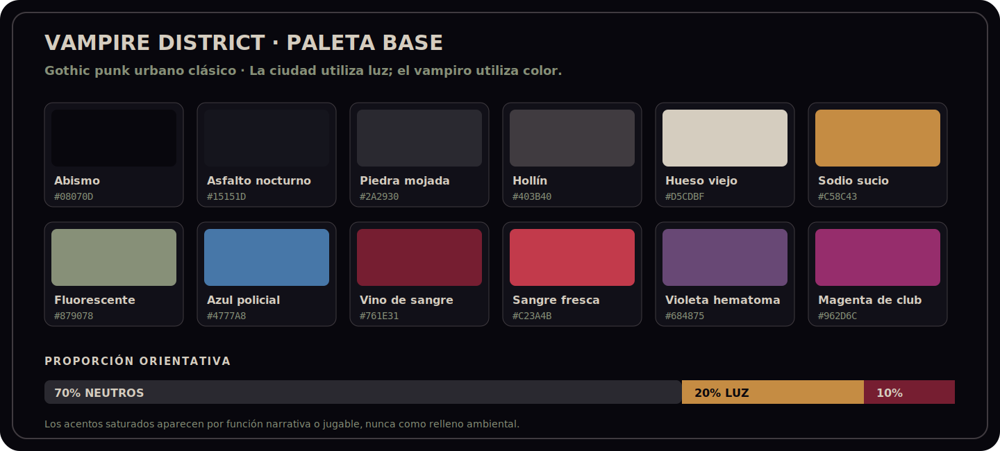

# Vampire District — Biblia visual resumida

> **Estado:** dirección base aprobada  
> **Dirección:** gothic punk urbano clásico  
> **Ámbito:** vertical slice y futura expansión del distrito  
> **Última actualización:** 2026-07-18

Este documento es la fuente de verdad para la dirección artística de **Vampire District**. Define el tono, la jerarquía visual y las reglas de producción; no pretende cerrar todavía cada asset, proporción o animación.

La referencia de género es el **gothic punk urbano de los años noventa**: decadencia contemporánea, romanticismo oscuro, subcultura nocturna y poder social. Debemos capturar ese espíritu sin reproducir logos, símbolos, tipografías, maquetaciones, personajes ni iconografía de *Vampire: The Masquerade* u otras propiedades.

## 1. Norte artístico

> **Una ciudad moderna, vieja y hostil, donde la belleza gótica sobrevive entre asfalto mojado, autoridad, basura y cultura underground.**

Regla central:

> **La ciudad utiliza luz; el vampiro utiliza color.**

El entorno se lee principalmente mediante masas de luz, sombra y material. El color saturado queda reservado para sangre, poderes, peligro, policía y puntos narrativos.

## 2. Pilares visuales

1. **El gótico es estructura.** Aparece en la arquitectura, la verticalidad, la piedra, las cornisas, el hierro y el peso histórico de la ciudad.
2. **El punk es cicatriz social.** Aparece en carteles arrancados, grafiti, cuero, cables, basura, locales underground, reparaciones improvisadas y oposición a la autoridad.
3. **Elegancia y mugre conviven.** Nada debe ser solamente refinado o solamente miserable; la tensión entre ambos extremos crea el tono.
4. **La lectura cenital manda.** Silueta, navegación, estados de NPC, rutas de altura y espacios de sombra tienen prioridad sobre el detalle decorativo.
5. **Lo sobrenatural irrumpe, no decora.** El vampiro parece casi humano en reposo. Hambre, poderes y alimentación revelan brevemente la naturaleza depredadora.

## 3. Tono y antitono

| Debe sentirse | No debe sentirse |
|---|---|
| Nocturno, húmedo, vivido y peligroso | Cyberpunk limpio o ciudad de neón constante |
| Romántico, decadente y socialmente hostil | Fantasía medieval o parque temático gótico |
| Sensual sin perder amenaza | Gore continuo o estética de Halloween |
| Noventero en actitud, no en nostalgia literal | Parodia retro llena de referencias obvias |
| Original y reconocible como *Vampire District* | Copia visual de otra franquicia vampírica |

## 4. Jerarquía visual

En cualquier captura, el ojo debe resolver este orden:

1. **Jugador y amenaza inmediata.**
2. **Testigos, policía, cazadores y objetivos.**
3. **Ruta transitable:** calle, sombra, salto, cornisa, escalera o alcantarilla.
4. **Landmark del barrio:** refugio, club, iglesia, comisaría.
5. **Textura y decoración ambiental.**

La decoración nunca puede ocultar una silueta, una ruta o un estado jugable. Todo asset debe seguir funcionando en escala de grises.

## 5. Paleta base propuesta

La paleta exacta se valida con la escena de prueba, pero estos roles quedan fijados.

| Rol | Nombre | Hex | Uso |
|---|---|---:|---|
| Fondo profundo | Abismo | `#08070D` | Vacíos, sombras máximas, marcos |
| Neutro principal | Asfalto nocturno | `#15151D` | Calles, tejados y grandes masas |
| Neutro medio | Piedra mojada | `#2A2930` | Aceras, muros, volumen secundario |
| Neutro alto | Hollín | `#403B40` | Bordes, desgaste, lectura de forma |
| Claro narrativo | Hueso viejo | `#D5CDBF` | Texto, papel, reflejos y detalles nobles |
| Luz urbana | Sodio sucio | `#C58C43` | Farolas, ventanas, interiores baratos |
| Luz enferma | Fluorescente | `#879078` | Pasillos, comisaría, servicio y alcantarilla |
| Autoridad | Azul policial | `#4777A8` | Policía, focos, interfaz de búsqueda |
| Vampírico bajo | Vino de sangre | `#761E31` | Hambre, ropa, símbolos y sombras sobrenaturales |
| Vampírico alto | Sangre fresca | `#C23A4B` | Impactos, alimentación, urgencia crítica |
| Oculto | Violeta hematoma | `#684875` | Poderes, susurro, percepción sobrenatural |
| Noche social | Magenta de club | `#962D6C` | Club, flyers y acentos underground |

**Distribución orientativa:** 70% neutros, 20% iluminación local y 10% acentos saturados.

Reglas:

- Rojo y violeta no se usan como ambientación genérica.
- Cada escena tiene una familia de acento dominante; dos familias solo cuando el conflicto jugable lo exige.
- Los landmarks se diferencian primero por forma y material, no por pintar cada edificio de un color distinto.
- El blanco puro se evita salvo destellos, flashes o reflejos de máxima intensidad.

## 6. Luz, sombra y clima

- La noche debe ser oscura, pero las superficies transitables nunca desaparecen en negro absoluto.
- Las sombras jugables se construyen como masas amplias y legibles, no como ruido fragmentado.
- **Farola urbana:** cálida, irregular y sucia.
- **Policía:** azul o blanco frío, direccional y móvil.
- **Club:** magenta degradado por humo, humedad y suciedad.
- **Sobrenatural:** vino, carmesí o violeta concentrado alrededor de una acción.
- Romper una farola debe cambiar de inmediato la composición: desaparece el foco cálido, crece una ruta oscura y las siluetas cercanas cambian de contraste.
- El pavimento mojado refleja mediante manchas y trazos rotos; nunca debe parecer un espejo pulido.
- Niebla, humo y lluvia se usan por zonas para separar profundidad y atmósfera, no como filtro permanente sobre toda la pantalla.

## 7. Lenguaje de la ciudad

Cada localización combina al menos **un elemento gótico, uno punk y uno funcional para gameplay**.

| Zona | Gótico | Punk | Función jugable |
|---|---|---|---|
| Refugio | Torre antigua, cornisa, hierro, piedra oscura | Antenas, cableado, acceso clandestino | Inicio, regreso, altura y silueta dominante |
| Mercado y bloques de viviendas | Ladrillo envejecido, patios, arcos parciales | Flyers, ropa tendida, reparaciones, basura | Rutas densas, civiles y líneas de visión cortas |
| Comisaría | Fachada cívica pesada, simetría, piedra fría | Barreras, focos, cartelería autoritaria | Presión policial, exposición y vigilancia |
| Club | Entrada teatral, reja ornamental, terciopelo sugerido | Cola, portero, posters, humo, neón barato | Objetivo social, testigos y alta densidad |
| Iglesia | Piedra, vidriera, estatuaria y geometría vertical | Grafiti, velas callejeras, indigencia, protesta | Landmark, contraste moral y rutas de sombra |
| Almacén y bloque viejo | Cerchas, ladrillo, remates industriales antiguos | Óxido, chapa, contenedores, pegatinas | Combate, escondites y aproximaciones laterales |
| Alcantarillas | Arcos de ladrillo, nichos y piedra húmeda | Tuberías, marcas, refugios improvisados | Ruta oculta, aislamiento y peligro acústico |

### Regla de composición por bloque

Un bloque completo debe contener:

- una masa arquitectónica antigua;
- una intervención contemporánea degradada;
- un punto de luz dominante;
- una ruta de sombra;
- un detalle humano o social;
- un punto de interacción o traversal claramente legible.

## 8. Materiales y props

Materiales principales:

- asfalto reparado y húmedo;
- ladrillo oscuro, piedra caliza sucia y hormigón envejecido;
- alquitrán de azotea, grava, canalones y charcos;
- hierro forjado, acero oxidado y malla metálica;
- vidrio viejo, neón deteriorado y plástico barato;
- papel pegado, tinta corrida, cinta adhesiva y pintura en aerosol.

Props prioritarios:

- farolas intactas y rotas;
- cornisas, gárgolas simplificadas y estatuas dañadas;
- escaleras de incendio, ductos, depósitos y antenas;
- contenedores, bolsas, botellas, periódicos y flyers;
- rejas, bolardos, vallas, cables y señales modificadas;
- velas, flores secas, pequeños altares y marcas clandestinas.

La textura debe contar una historia. No aplicar ruido uniforme a todo: la humedad se concentra en desagües, la basura en esquinas, los carteles cerca del club y el desgaste en rutas de paso.

## 9. Personajes y siluetas

La identidad se diseña primero desde arriba y a tamaño de juego. Cabeza, hombros, manos, pies, largo de chaqueta y postura importan más que el detalle facial.

### Protagonista

- Abrigo o chaqueta larga con faldones asimétricos.
- Silueta estrecha, rápida y ligeramente inclinada hacia delante.
- Base casi negra con un único acento vino.
- Ojos rojos, colmillos y rasgos monstruosos solo aparecen durante estados sobrenaturales.
- La sombra puede ser un poco más larga o retrasarse una fracción durante poderes.

### Sire y vampiros de poder

- Menos movimiento innecesario y postura muy controlada.
- Silueta limpia, materiales nobles desgastados y acentos mínimos.
- La autoridad se comunica mediante quietud, espacio alrededor y ritmo, no mediante armaduras o capas gigantes.

### Civiles

- Familias de silueta: clientela del club, trabajadores nocturnos, vecinos, personas sin hogar y transeúntes.
- Variación en postura, velocidad y agrupación para que la calle parezca social, no un tablero de objetivos.

### Policía, matones y cazadores

- **Policía:** hombros cuadrados, geometría rígida, azul y blanco frío.
- **Matones/punks:** asimetría, botas, chaqueta corta, brazos o accesorios más pesados.
- **Cazadores:** silueta funcional, pálida y austera; iconografía religiosa o ritual solo en detalles secundarios.

### Movimiento

- Humanos: pequeños titubeos, balance y reacciones visibles.
- Vampiros: aceleración limpia, giros precisos y menos rebote corporal.
- Policía: desplazamiento coordinado y frontal.
- Cazadores: ataques comprometidos, pesados y sin teatralidad.

Los estados **desprevenido, alerta, persiguiendo, tambaleándose, derribado y drenado** deben entenderse sin texto.

## 10. Lenguaje sobrenatural

- **Estado normal:** el vampiro se integra visualmente en la ciudad.
- **Hambre alta:** baja levemente la saturación del mundo, aparecen pulsos periféricos y las presas ganan presencia.
- **Hambre crítica:** el rojo invade bordes y latidos, pero nunca tapa rutas, ataques o visión enemiga.
- **Blood Sense:** mundo desaturado; seres vivos muestran pulsos internos y rastros discretos. Evitar el filtro rojo completo.
- **Shadow Dash:** desgarro oscuro, dos ecos breves y pérdida de detalle local. No usar estela de neón.
- **Vampiric Whisper:** onda violeta tenue semejante a tinta o vibración, no un proyectil mágico.
- **Drenaje:** composición íntima y contenida: bloqueo de siluetas, caída del entorno sonoro y un destello de sangre. Evitar explosiones de partículas.
- **Exposición sobrenatural:** intrusión visual progresiva en testigos, HUD y bordes de pantalla; debe sentirse como pérdida de control social.

## 11. UI y tipografía

Concepto de interfaz:

> **Expediente clandestino + flyer de club + editorial funeraria.**

- Titulares: serif afilada o condensada con carácter editorial; uso puntual.
- Información, controles y números: sans serif condensada y muy legible.
- Paneles: negro mate, hueso viejo, líneas finas, sellos, recortes y grano de fotocopia.
- Evitar pergamino medieval, marcos barrocos excesivos, cristal brillante y orbes de fantasía.
- Conservar el HUD compacto actual, pero migrar gradualmente de degradados brillantes a superficies más planas, impresas y táctiles.

Semántica fija:

| Sistema | Color principal |
|---|---|
| Hambre / alimentación | Vino y sangre fresca |
| Policía / búsqueda | Azul policial |
| Objetivos / interacción | Hueso y sodio |
| Poderes / oculto | Violeta hematoma |
| Peligro físico inmediato | Sangre fresca o blanco de impacto |

Los símbolos deben ser originales. Motivos posibles: rosa alambrada, halo partido, arco de catedral roto, sello cívico corrompido o luna mordida.

## 12. Reglas técnicas de lectura cenital

- Diseñar y validar sobre la composición base del mundo `960 × 640`, comprobando como mínimo los presets Compact y Ultra.
- Ningún rasgo crítico puede depender de una línea más fina que dos píxeles renderizados en Compact.
- Jugador, civil, policía y cazador deben distinguirse por silueta en escala de grises.
- Un prop pequeño usa como máximo tres grupos de valor: masa, material y acento.
- Los bordes de azotea necesitan una cara iluminada clara y una sombra de caída consistente para comunicar altura.
- Saltos y descensos se anticipan con geometría del borde, desgaste, hueco y zona de aterrizaje; no con etiquetas permanentes.
- Luces, conos de visión, prompts y VFX nunca deben compartir exactamente el mismo grosor, color y ritmo.
- El detalle de alta frecuencia se concentra en landmarks; las rutas de navegación permanecen visualmente más limpias.

## 13. Prioridad de producción

1. **Kit modular de calle, azotea y alcantarilla.**
2. **Siluetas y animaciones básicas:** protagonista, civil, policía, matón y cazador.
3. **Sistema visual de luz y sombra**, incluida la farola rota.
4. **Landmarks:** refugio, club, iglesia y comisaría.
5. **VFX de hambre, Blood Sense, Dash, Whisper y drenaje.**
6. **Skin de UI y tipografía.**
7. Variantes, decoración rara y detalle de alta frecuencia.

No producir muchos assets únicos antes de que el kit modular y la lectura de gameplay estén validados.

## 14. Escena de prueba obligatoria

Antes de sustituir el arte del distrito completo, crear una escena jugable que contenga:

- una avenida mojada y un callejón oscuro;
- dos alturas de azotea, un salto y una escalera de incendio;
- una farola que pueda romperse;
- una esquina del club y otra de la iglesia;
- protagonista, civil, policía, matón y cazador;
- un drenaje, un golpe, Blood Sense y Shadow Dash;
- estados normal, hambre crítica y alerta policial.

### Criterios de aceptación

- Una captura sin UI se reconoce como **gothic punk urbano**.
- La ruta principal y una ruta de sombra se entienden en menos de dos segundos.
- Los cinco tipos de personaje se distinguen a tamaño real de juego.
- Romper la farola cambia de forma evidente la lectura táctica del espacio.
- Blood Sense añade información sin convertir toda la pantalla en rojo.
- Club, iglesia, comisaría y refugio se reconocen por silueta y material.
- La escena sigue siendo legible en Compact y no parece vacía en Ultra.

## 15. Decisiones cerradas y abiertas

### Cerradas

- Gothic punk urbano clásico como dirección principal.
- Ciudad contemporánea y decadente; no medieval ni cyberpunk.
- Lectura cenital y gameplay por encima del detalle ornamental.
- Rojo y violeta reservados para estados vampíricos y narrativos.
- Iconografía, personajes y diseño editorial originales.
- Luz y sombra como parte del lenguaje de sigilo.

### Propuestas a validar en la escena de prueba

- Hex exactos de la paleta.
- Proporciones finales de personajes y largos de abrigo.
- Intensidad de reflejos, lluvia, grano y textura.
- Familia tipográfica concreta.
- Cantidad de ornamentación gótica por barrio.
- Nivel de estilización frente a pixel art tradicional.

### Diferido

- Vestuario detallado por linaje o facción vampírica.
- Retratos narrativos y key art promocional.
- Variaciones estacionales o diurnas.
- Distritos fuera del vertical slice.

## 16. Regla de mantenimiento

Cualquier cambio que altere paleta, iluminación, siluetas, materiales, VFX, UI, iconografía o lectura de rutas debe actualizar este documento en el mismo commit o serie de commits.

Las referencias externas sirven para analizar tono y soluciones, no para copiar. No se deben incorporar al repositorio escaneos, páginas o imágenes con copyright sin permiso; los moodboards de producción deben usar material propio, licenciado o enlazado con atribución adecuada.
